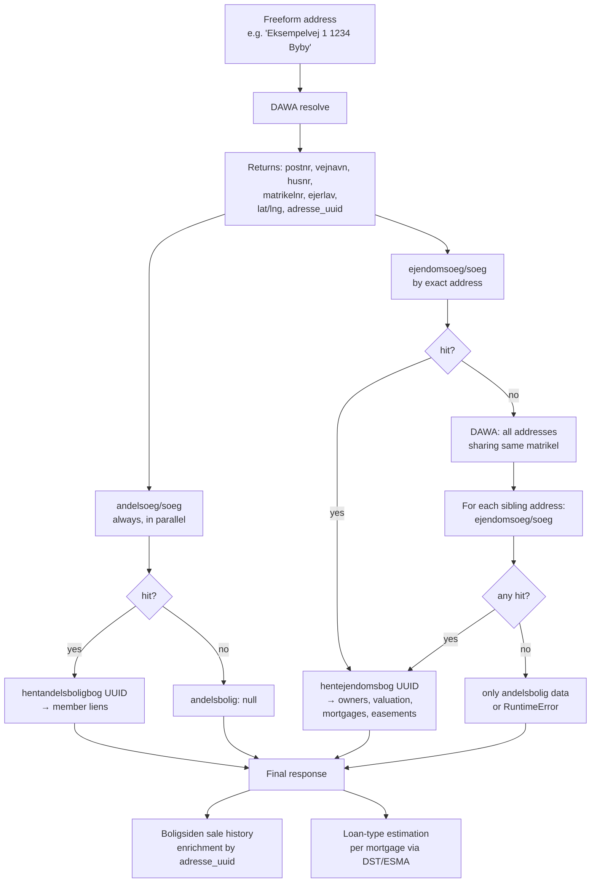
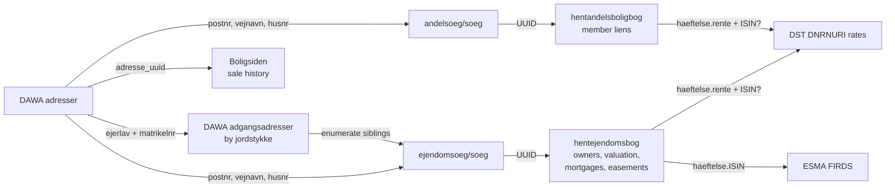
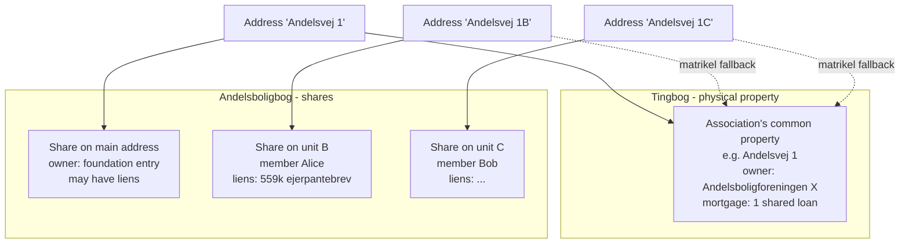

# nosynabo

## What is nosynabo?

**nosynabo** combines "nosy" (curious/inquisitive) and "nabo" (Danish for neighbor) — it's a tool for the curious neighbor who wants to look up public property information about any Danish address.

The tool aggregates publicly available Danish property data from multiple open registers. It retrieves only **public data from public sources** and presents it in an easy-to-use interface.

nosynabo composes information from official Danish registers — tinglysning.dk (property records), DAWA (address data), Boligsiden (sale history), and others — requiring no special authorization. All data accessed is by design publicly available to anyone; the tool simply assembles it conveniently in one place via a map-based web UI or command-line interface.

---

Look up Danish property records from [tinglysning.dk](https://www.tinglysning.dk) via a map-based browser UI or a command-line tool.

> Originally forked from [jkiddo/nosyneighbour](https://github.com/jkiddo/nosyneighbour) and has since diverged significantly. Licensed under **AGPL-3.0** (see [LICENSE](LICENSE)).

Given any freeform Danish address you get:

- **Owners** (ejere) with ownership share
- **Valuation** (vurdering) — property value, land value, municipality
- **Estimated equity** (friværdi) — valuation minus total registered mortgage principals
- **Mortgages and liens** (hæftelser) — including estimated loan type (F-kort / F1 / F3 / F5) for variable-rate realkreditlån
- **Easements** (servitutter)
- **Historical sale prices** (salgshistorik) — previous transactions with price, area and kr/m² via Boligsiden
- **Active listing indicator** — if the property is currently for sale on Boligsiden, the address becomes a direct link to the listing and is marked with a "Til salg" badge

Loan type estimation works by matching the registered coupon rate against [Nationalbanken rate statistics](https://www.dst.dk/da/Statistik/emner/penge-og-kapitalmarked/renter/realkreditrenter) (DST table DNRNURI). When an ISIN is known, the type is confirmed definitively via [ESMA FIRDS](https://registers.esma.europa.eu).

---

## Running locally

**Requirements:** Python 3.10+

```bash
python -m venv .venv
source .venv/bin/activate
pip install -r requirements.txt

# Web UI (http://localhost:8000)
python server.py

# CLI
python nosy_nabo.py "Eksempelvej 1, 1234 Byby"
```

---

## Running with Docker

```bash
# Build
docker build -t nosynabo .

# Run (web UI on http://localhost:8000)
docker run -p 8000:8000 nosynabo
```

### Production deployment (Docker Compose + Caddy)

A `compose.yml` is included that runs the app behind a [Caddy](https://caddyserver.com) reverse proxy with automatic HTTPS via DuckDNS.

```bash
cp .env.example .env
# edit .env with your values
docker compose up -d
```

Caddy listens on port **18000** and proxies to the app. Set `DUCKDNS_DOMAIN` to your own DuckDNS subdomain (e.g. `yourname.duckdns.org`).

---

## Web UI

Open `http://localhost:8000` in a browser.

- **Search** by typing an address in the sidebar — autocomplete is powered by [DAWA](https://dawadocs.dataforsyningen.dk).
- **Click the map** to look up the property at that location (reverse geocoding via [Dataforsyningen](https://dataforsyningen.dk)).
- Up to **10 addresses** can be pinned simultaneously. Each gets a numbered marker; click a marker to scroll to its details in the sidebar.
- Remove any address with the **×** button in its header.

---

## API

| Endpoint | Parameters | Description |
|---|---|---|
| `GET /api/autocomplete` | `q` | DAWA address autocomplete |
| `GET /api/reverse` | `lat`, `lng` | Reverse geocode a map click to an address |
| `GET /api/lookup` | `q` | Full property lookup by freeform address |

### Example

```bash
curl "http://localhost:8000/api/lookup?q=Eksempelvej+1+Byby"
```

```json
{
  "adresse": "Eksempelvej 1, 1234 Byby",
  "ejendomstype": "Ejerlejlighed",
  "matrikler": [{ "matrikelnummer": "...", "landsejerlavnavn": "..." }],
  "vurdering": {
    "vurderingsdato": "2022-01-01",
    "ejendomsvaerdi": 2650000,
    "grundvaerdi": 312500,
    "kommune": "Aarhus"
  },
  "ejere": [{ "navn": "...", "andel": "1/1" }],
  "haeftelser": [
    {
      "prioritet": "1",
      "haeftelsestype": "Realkreditpantebrev",
      "hovedstol": "1.716.000 kr.",
      "rente": "1.5",
      "fastvariabel": "variabel",
      "kreditorer": ["Totalkredit A/S"],
      "loan_type_info": {
        "source": "estimated",   // or "esma_firds" when confirmed via ISIN
        "loan_type": "F3",
        "uncertain": false,      // true when the rate falls close to a boundary
        "close_to": [],          // nearby loan types when uncertain is true
        "candidates": [...]      // all rate-matched candidates considered
      }
    }
  ],
  "servitutter": [...],
  "andelsbolig": null,
  "_matrikel_fallback": null
}
```

For addresses in the Andelsboligbogen (cooperative housing register), `andelsbolig` contains the member's individual liens and `_matrikel_fallback` may be populated. See [Cooperative housing data model](#cooperative-housing-data-model) for details.

---

## Data sources

nosynabo composes data from several public Danish registers. None of them require authentication for the read paths we use, but a few require solving a client-side proof-of-work (ALTCHA) before they respond.

| Source | Used for | Auth |
|---|---|---|
| **DAWA** (Dataforsyningen) | Freeform address resolution, autocomplete, reverse geocoding, enumeration of addresses on a matrikel | None |
| **Datafordeler BBR** | Not currently used by the UI, but `resolve()` returns the `adgang_uuid` which is BBR's primary key | None |
| **tinglysning.dk ejendomsoeg** | Physical property records: owners, valuation, mortgages, easements | ALTCHA |
| **tinglysning.dk andelsoeg** | Cooperative-share records: individual member's mortgages on their share | ALTCHA |
| **Boligsiden** | Historical sale prices; active listing status and link | None |
| **DST DNRNURI** | Nationalbanken rate statistics (for loan-type estimation) | None |
| **ESMA FIRDS** | Definitive loan-type via ISIN lookup (when the caller provides an ISIN) | None |

ALTCHA is a CAPTCHA-style proof-of-work: the server hands out a challenge, the client solves a short hash puzzle, and submits the answer with the actual request. `nosy_nabo.py` solves ALTCHA transparently.

---

## Lookup flow

A single call to `GET /api/lookup?q=…` kicks off this decision tree. The ejendomsoeg and andelsoeg paths can both succeed for the same address — the cooperative association's main address appears in both registers independently (see [Cooperative housing data model](#cooperative-housing-data-model)).



The matrikel fallback (the `F -> G -> G1` branch) handles umbrella properties — hospitals, large farms, cooperative associations — where the user's exact address is just a sub-entry on a parent matrikel owned under a different address. DAWA knows every address tied to a given (ejerlav, matrikelnr) pair, so we iterate those addresses and try each as a tinglysning search target until one resolves.

---

## Key insight: UUID reuse across endpoints

Every entity in tinglysning.dk has a stable UUID. These UUIDs are **not per-endpoint** — the UUID you get from `ejendomsoeg/soeg` is the same UUID that identifies the record in `ejendomsoeg/hentejendomsbog`, and likewise for `andelsoeg/soeg` → `andelsoeg/hentandelsboligbog`.

This means every "list search" endpoint becomes an addressable entry point to the detailed record behind it, without needing a separate lookup step. It also means that if two addresses share the same UUID in one of these registers, they refer to the same legal entity (useful for detecting that e.g. an apartment in an ejerlejligheds-complex resolves to the same tingbog as its neighbours).



Concretely verified identity relationships:

| Register | List endpoint | Detail endpoint | UUID shared? |
|---|---|---|---|
| Tingbog | `ejendomsoeg/soeg` | `ejendomsoeg/hentejendomsbog/<uuid>` | Yes — verified 2026-04 |
| Andelsboligbog | `andelsoeg/soeg` | `andelsoeg/hentandelsboligbog/<uuid>` | Yes — verified 2026-04 |
| Authenticated (MitID) | `rest/ejendomsoeg/*` | `rest/ejendomsoeg/*` | Same UUID as unsecrest counterpart — verified 2026-04 |

The last row has an important operational implication: if a user has an authenticated browser session with tinglysning.dk and fetches a UUID via the authenticated (`rest/…`) surface, the same UUID works against `unsecrest/…` without auth. The registers are the same; only the viewing surface changes.

---

## Cooperative housing data model

Danish cooperative housing (andelsbolig) splits ownership between two separate registers:

1. The **association** owns the physical property — registered in **Tingbog** (`ejendomsoeg`).
2. Each **member** owns a share in the association — registered in **Andelsboligbog** (`andelsoeg`).

Member loans against the share live in Andelsboligbog, not Tingbog. If nosynabo only queried ejendomsoeg, a cooperative member's individual mortgages would be invisible.



Empirical findings driving the current lookup logic:

- The association's main address is in **both** ejendomsoeg AND andelsoeg. They return different UUIDs because they're different legal entities: the property vs. the share headquarters.
- Individual member addresses (sub-units) are **only** in andelsoeg. They resolve to the association's tingbog via matrikel fallback.
- There is **no marker in DAWA** distinguishing a cooperative address from a standalone property. Every address must be asked both registers.

As a result, `lookup_address()` always queries andelsoeg in parallel with ejendomsoeg. The response shape reflects this dual nature:

```json
{
  "adresse": "Andelsvej 1, 1234 Byby",
  "ejere": [{ "navn": "Andelsboligforeningen X" }],
  "haeftelser": [ /* the association's shared mortgage */ ],
  "andelsbolig": {
    "adresse": "Andelsvej 1, 1234 Byby",
    "haeftelser": [ /* the share's own liens, if any */ ]
  }
}
```

When `andelsbolig` is `null`, the address is a standalone property. When `andelsbolig` is present alongside non-empty `ejere`/`haeftelser`, you have the association-HQ case. When `andelsbolig` is present but `_matrikel_fallback` is set, you have an individual member.

---

## MCP server

The service exposes an [MCP](https://modelcontextprotocol.io) server at `POST /mcp` using the Streamable HTTP transport. Connect any MCP-compatible client (Claude Desktop, Claude Code, etc.) to `http://localhost:8000/mcp`.

### Tool: `lookup_property`

| Parameter | Type | Description |
|---|---|---|
| `address` | `string` | Freeform Danish address |

Returns the same JSON payload as `GET /api/lookup`.

### Claude Desktop config

```json
{
  "mcpServers": {
    "nosynabo": {
      "url": "http://localhost:8000/mcp"
    }
  }
}
```

### Claude Code

```bash
claude mcp add --transport http nosynabo http://localhost:8000/mcp
```

---

## CLI

```
usage: nosy_nabo.py [-h] [--isin PRIORITY:ISIN] address [address ...]

positional arguments:
  address              Freeform address, e.g. "Eksempelvej 1 1234 Byby"

options:
  --isin PRIORITY:ISIN  ISIN for a specific mortgage, as priority:ISIN
                        (e.g. --isin 1:DK0004632486). Can be repeated.
```

When an ISIN is supplied for a mortgage, the loan type is resolved definitively from ESMA FIRDS instead of estimated from rate statistics.

---

## License

Copyright (C) 2026 Doessing.

This program is free software: you can redistribute it and/or modify it under the terms of the **GNU Affero General Public License** as published by the Free Software Foundation, either version 3 of the License, or (at your option) any later version. See [LICENSE](LICENSE) for the full text.

If you run a modified version of this software as a network service, the AGPL requires you to offer the source of your modifications to its users.

Portions originate from [jkiddo/nosyneighbour](https://github.com/jkiddo/nosyneighbour).
